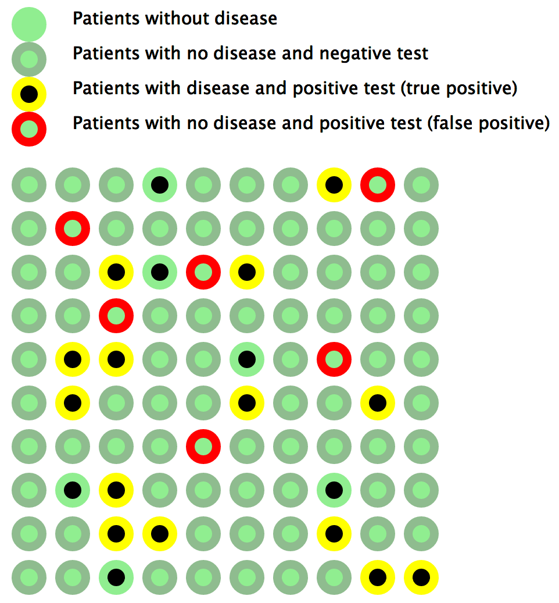

# Reactive documents for simple epidemiological calculations/Bayes theorem

These reactive documents are published [here](http://apps.keithflower.org/?p=488).

They were created using the excellent Tangle and D3 libs.

## License

Copyright © 2013 Keith Flower

Distributed under the MIT License.
